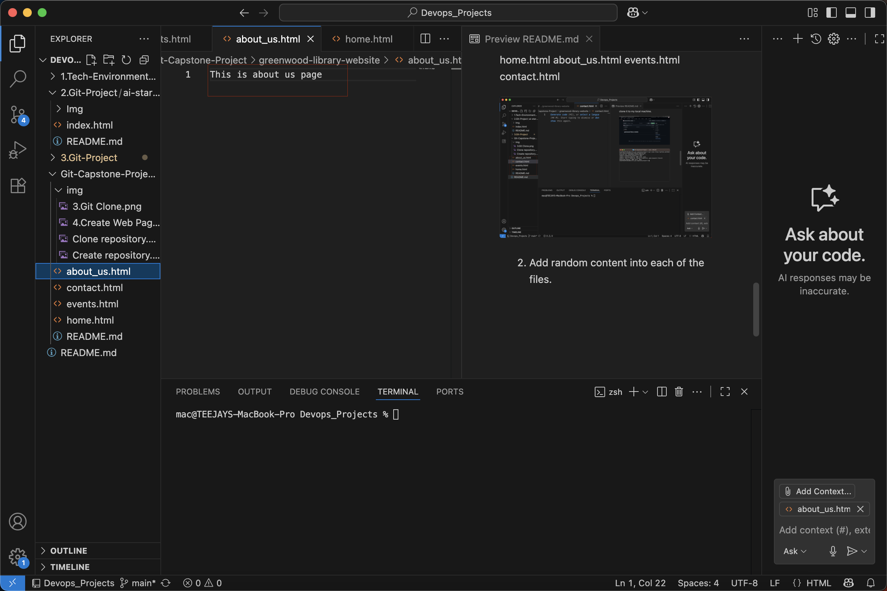
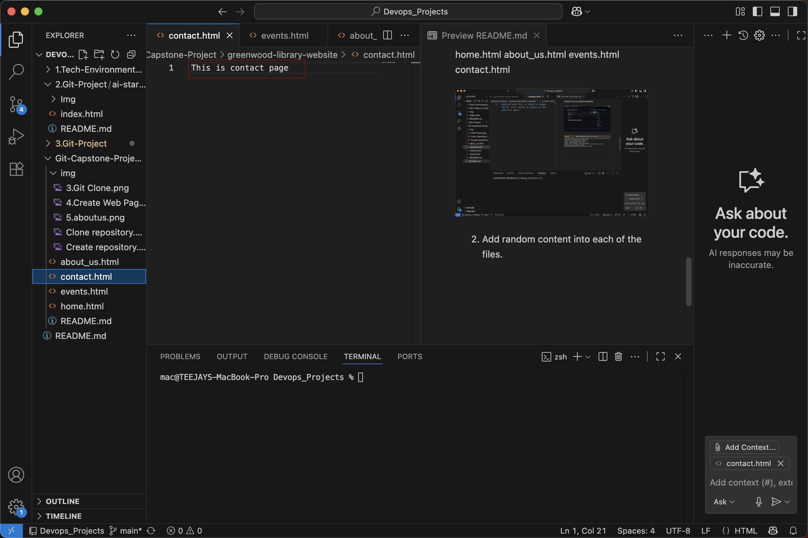
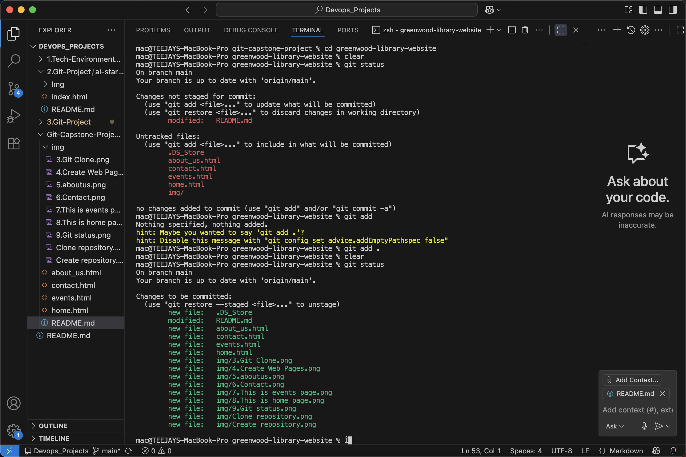
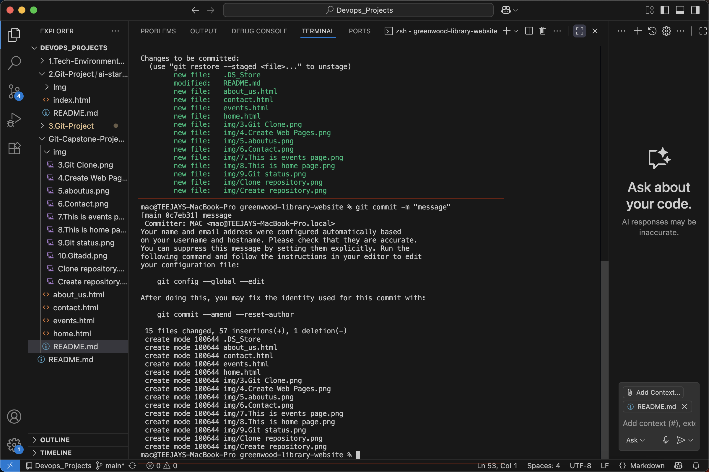
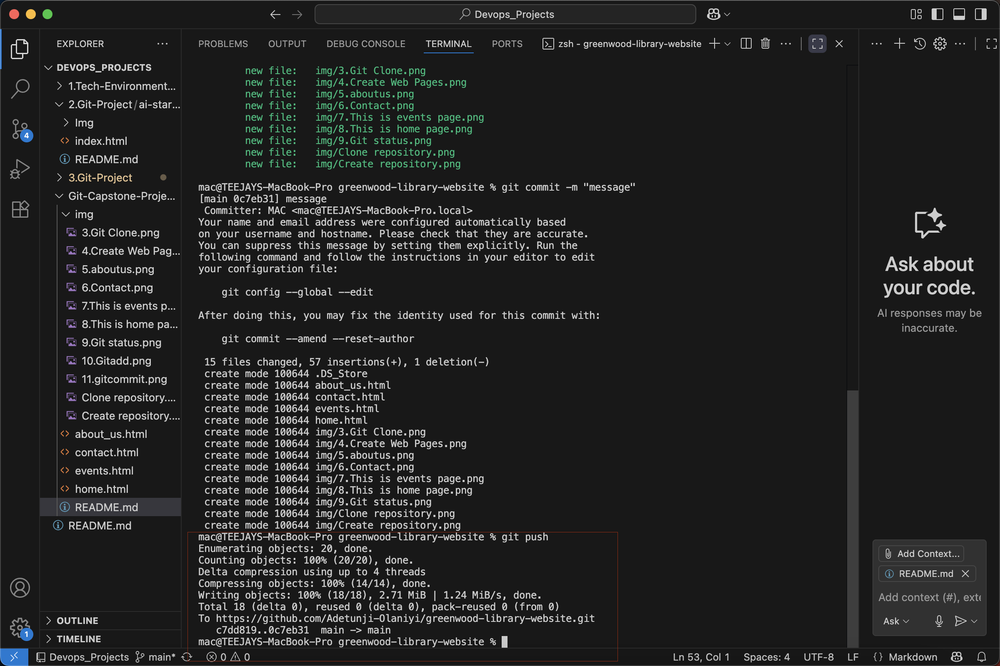
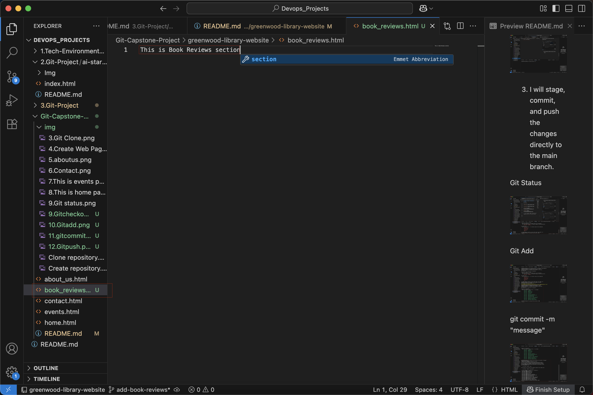

# Captone Project: Enhancing a Community Library Website

## Background Scenario

You are part of a development team tasked with enhancing the website for the "Greenwood Community Library". The website aims at be more engaging and informative for its visitors. It currently includes basic section: Home, About US, Events, and Contact US. Your team decided to add a "Book Reviews" section and update the "Events" page to feature upcoming community events.

You will simulate the roles of two contributors: "Morgan" and "Jamie". Morgan will focus on adding the "Book Reviews" section. while "Jamie" will update the "Events" page with new community events.

## Objectives

Practice cloning a repository and working with branches in git.

Gain experince in stagging, commiting, and pushing changes from both developers.

Create pull requests and merge them after resolving any potential conflicts.

## Setup

1. Create a repository on GitHub:

a. Name it greenwood-library-website.

b. Initialized it with a README.md file and clone it to my local machine.

## Tasks 

In the main branch, using Visual Studio code editor, I will ensure there are files for each of the web pages.

home.html
about_us.html
events.html
contact.html

2. Add random content into each of the files.

3. I will stage, commit, and push the changes directly to the main branch.

Git Status

Git Add

git commit -m "message"

git push

## Morgan's Work: Adding Book Reviews

1. Create a Branch for Morgan:

git checkout -b add-book-reviews

2. Switch to a new branch name add-book-reviews

3. Add a new file "book_reviews.html" to represent the book reviews sections:

4. Add a random text content into the file

5. Stage, commit, and push chnages with a message "Add book reviews sections."